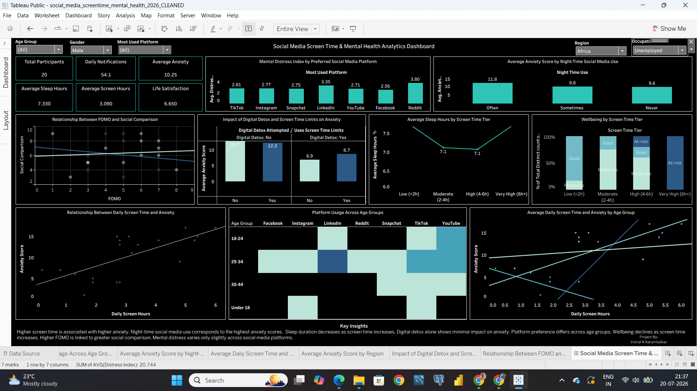
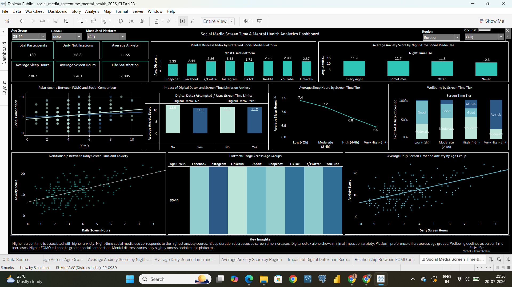

# 📊 Social Media Screen Time & Mental Health Analysis





---

## 📌 Project Overview

Social media has become an integral part of daily life, but excessive usage can significantly influence mental well-being. This project analyzes the relationship between screen time, social media usage patterns, sleep habits, digital detox behavior, Fear of Missing Out (FOMO), and mental health indicators.

The dataset was cleaned and transformed using **Python (Pandas)** and visualized using **Tableau** to identify meaningful behavioral patterns and provide actionable insights.

---

## 🎯 Business Problem

The objective of this analysis is to answer questions such as:

- Does increased screen time lead to higher anxiety?
- Does using social media at night affect mental health?
- Is attempting a digital detox associated with lower anxiety?
- Which social media platforms show higher mental distress?
- How does FOMO influence social comparison?
- Which age groups spend the most time on different platforms?
- How does screen time affect sleep duration and overall wellbeing?

---

## 🛠️ Tools & Technologies

| Tool | Purpose |
|------|---------|
| Python | Data Cleaning & Transformation |
| Pandas | Data Manipulation |
| NumPy | Data Processing |
| Tableau Public | Dashboard Development |
| Excel | Initial Data Review |

---

## 📂 Project Workflow

```
Raw Dataset
      │
      ▼
Python Data Cleaning
      │
      ▼
Data Transformation
      │
      ▼
Exploratory Analysis
      │
      ▼
Interactive Tableau Dashboard
      │
      ▼
Business Insights
```

---

## 📊 Dashboard Preview

> *(Replace the image path below with your uploaded dashboard image.)*

```markdown

```

---

## 📈 Dashboard KPIs

- 👥 Total Participants
- 🔔 Average Daily Notifications
- 😴 Average Sleep Hours
- 📱 Average Daily Screen Time
- 😟 Average Anxiety Score
- 😊 Life Satisfaction Score

---

## 📊 Dashboard Visualizations

- Relationship Between Daily Screen Time & Anxiety
- Average Anxiety by Night-Time Social Media Usage
- Mental Distress by Preferred Platform
- Platform Usage Across Age Groups
- Average Sleep Hours by Screen Time Tier
- Wellbeing Distribution by Screen Time Tier
- FOMO vs Social Comparison
- Digital Detox & Screen Time Limits vs Anxiety

---

## 🔍 Key Insights

### 📌 Screen Time & Anxiety

A positive relationship exists between daily screen time and anxiety, indicating that individuals with higher screen time generally report higher anxiety scores.

---

### 🌙 Night-Time Social Media Usage

Participants who use social media every night have the highest average anxiety levels, while those who never use social media at night report the lowest anxiety.

---

### 😴 Sleep Duration

Average sleep hours decrease consistently as daily screen time increases, suggesting excessive screen usage negatively impacts sleep quality.

---

### 📱 Platform Preference

Mental distress levels remain relatively similar across major social media platforms, indicating that usage behavior may have a greater impact than platform choice.

---

### 👥 Age Group Trends

Young adults (18–34 years) demonstrate the highest engagement across most social media platforms.

---

### 📵 Digital Detox

Attempting a digital detox alone shows minimal difference in average anxiety, suggesting that simply taking breaks may not be sufficient without broader behavioral changes.

---

### 😟 FOMO & Social Comparison

A moderate positive relationship exists between Fear of Missing Out (FOMO) and social comparison, indicating that higher FOMO is associated with greater comparison behavior.

---

### ❤️ Wellbeing

Wellbeing decreases progressively as daily screen time increases, while the proportion of at-risk participants becomes higher among heavy users.

---

## 📁 Repository Structure

```
Social-Media-Screen-Time-Mental-Health-Analysis
│
├── README.md
├── data
│   ├── raw_dataset.csv
│   └── cleaned_dataset.csv
│
├── notebooks
│   └── data-cleaning.ipynb
│
├── tableau
│   └── social-media-dashboard.twbx
│
└── images
    └── dashboard-overview.png
```

---

## 🚀 Future Improvements

- Predict anxiety levels using Machine Learning
- Build an interactive dashboard using Power BI
- Deploy the dashboard on Tableau Public
- Create a Streamlit web application
- Perform sentiment analysis using social media text data

---

## 👨‍💻 Author

**Vishal N. Karambalkar**

📧 Email: vishalkarambalkar.tech@gmail.com

💼 LinkedIn: https://www.linkedin.com/in/vishal-karambalkar

🐙 GitHub: https://github.com/Vishal-karambalkar

---

## ⭐ If you found this project useful, consider giving it a Star!
